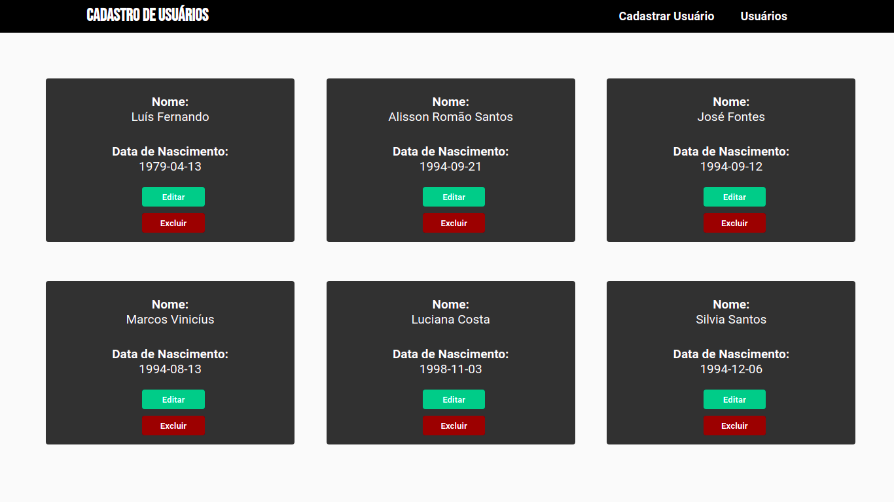

<h1 align="center">Projeto Sign Up</h1>



## Tecnologias
   - Node
   - Sequelize ORM
   - Express
   - MYSQL

## Como executar
##### Clone o repositório
```bash
git clone https://github.com/alissonrsantos/sign-up-api.git
```
##### Abra a pasta
```bash
cd sign-up-api
```

##### Abra no Vscode
```bash
code .
```

##### Instale as dependências
```bash
npm install
```
ou

```bash
yarn
```

##### Abra no navegador
```bash
npm run dev
```
ou

```bash
yarn dev
```

### Funcionalidades
  - [ x ] Listar usuários
  - [ x ] Criar usuários
  - [ x ] Atualizar dados dos Usuários
  - [ x ] Excluir usuários

### &copy; Licença
MIT

Feito por Alisson Romão Santos |
[LINKEDIN](https://linkedin.com/in/alissonrsantos) :)
